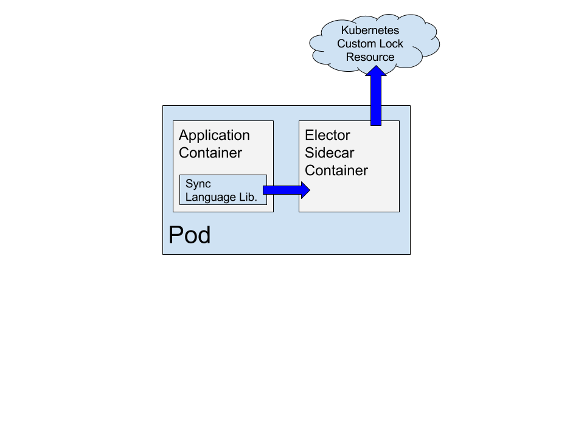

# Metaparticle/Sync Overview

Metaparticle/Sync is a cloud-native standard library for synchronization in
distributed systems. It provides language idiomatic locking and election
for a variety of systems in different languages on top of Kubernetes.

## Design

There are two components to the Metaparticle/Sync library:
   * A [shared sidecar container](https://github.com/metaparticle-io/container-lib/elector) that implements most of the locking logic
   * Idiomatic language bindings that use the side-car to implement cloud-native locking in a particular language.

### Sidecar container.
This sidecar container runs next to the main application
code, and is identical regardless of what idiomatic language binding you are
using. The role of the side-car is to do the heavy lifting for the lock
protocol.

When it runs, the side car container creates a new Kubernetes Custom Resource
Definition type called a 'lock'. When a particular lock is created, the sidecar
attempts to claim the lock by writing it's hostname and a time-to-live (TTL)
into the lock object. If this succeeds the sidecar has the lock for the
length of the TTL. If this fails, someone else has the lock.

If the sidecar acquires the lock, it heartbeats on the lock to retain the lock.
If the side car fails to acquire the lock, it attempts to re-acquire the lock
after it's time to live (TTL) has expired.

### Idiomatic Language bindings
The idiomatic or fluent language bindings provide a native interface for
distributed locks that feels natural to developers in a particular language.
These bindings all assume the presence of the locking sidecar container, and
indeed are largely thin programattic wrappers on top of the HTTP api exposed
by the sidecar. To ensure that the locks are not held if the language
code deadlocks (for example) the language bindings are responsible for
heartbeatung to the sidecar container, which in turn heart-beats to the
sidecar lock container.

### Protocol
The sidecar exposes a simple HTTP based protocol on `http://localhost:8080`.
 
   * A `GET` to `http://localhost:8080/locks/<name>` returns if the lock exists.
 If the lock exists, a `200` is returned. Otherwise a `404` is returned.
   * A `PUT` to `http://localhost:8080/locks/<name>` attempts to create the lock, or heartbeats if the lock already exists. The `PUT` returns:
      * `200` if the create or heartbeat succeeds
      * `409` if the attempt to create or heartbeat the lock conflicts with someone else obtaining the lock.

The TTL for the lock is currently hard-coded at 30 seconds.If a heartbeat does not occur in that time-frame, the lock is lost.
